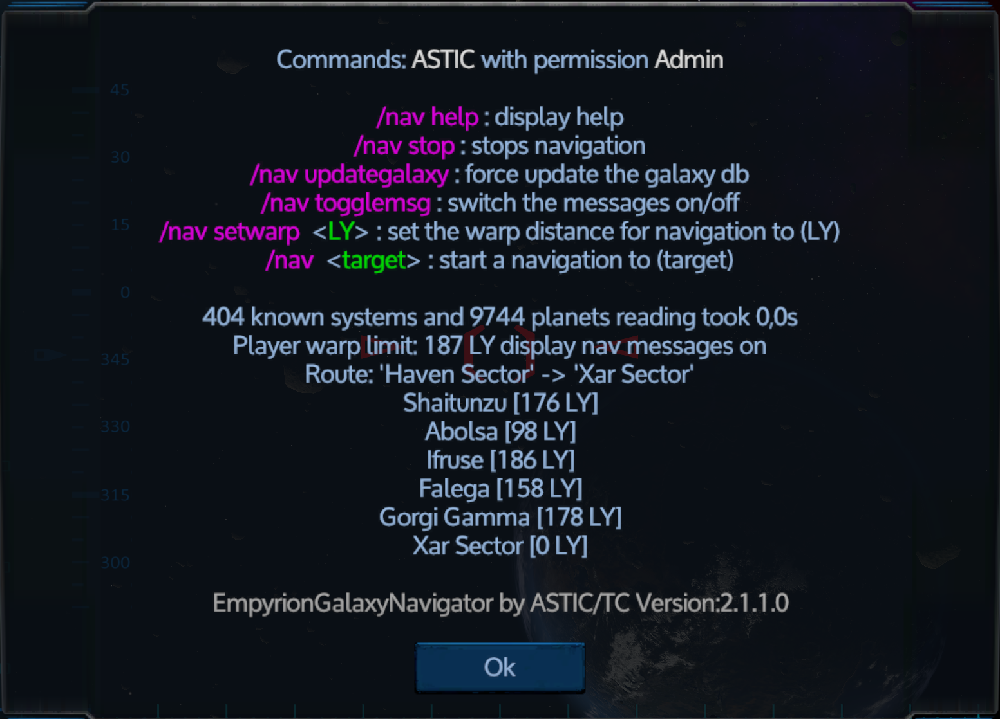
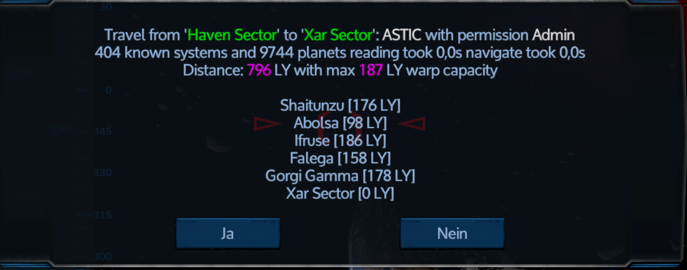
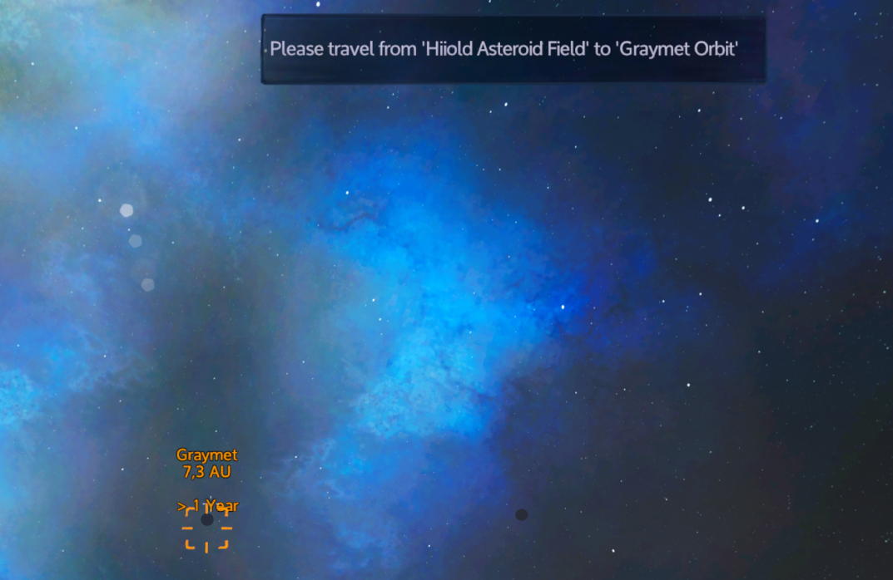

# EmpyrionGalaxyNavigator
## Installation
1. Download der aktuellen ZIP datei von https://github.com/GitHub-TC/EmpyrionGalaxyNavigator/releases
1. Upload der Datei im EWA (EmpyrionWebAccess) MOD oder händische installation mit dem ModLoader aus https://github.com/GitHub-TC/EmpyrionGalaxyNavigator

## Wo für ist das?
Hiermit kann eine Navigation durch die Galaxie gestartet werden die einen durch die Galaxie zum Ziel leitet.

## Kommandos

* \\nav help =&gt; Liste der Kommandos
* \\nav stop =&gt; Eine laufende Navigation abbrechen
* \\nav &lt;target&gt; =&gt; Hiermit kann einen Navigation vom aktuellen Standort zum Ziel &lt;target&gt; gestartet werden. z.B. \nav Akua

## Konfiguration
* LogLevel: Steuerung des Loggings
* ChatCommandPrefix: Zeichenfolge mit dem die Chatkommandos beginnen müssen
* MessageLoopMS: In welchem Intervall soll die Navigationsmeldung angezeigt werden
* NavigationTargets: Enthält die von Spielern gestarten laufenden Navigationen

***

English-Version:

---

# Empyrion ShipBuying
## installation
1. Download the latest ZIP file from https://github.com/GitHub-TC/EmpyrionGalaxyNavigator/releases
1. Upload the file in the EWA (EmpyrionWebAccess) MOD or manual installation with the ModLoader from https://github.com/GitHub-TC/EmpyrionGalaxyNavigator

## What is it for?
This can be used to start a navigation through the galaxy, which guides you through the galaxy to the destination.

## Commands

* \\nav help =&gt; List of commands
* \\nav stop =&gt; Cancel a running navigation
* \\nav &lt;target&gt; =&gt; This can be used to start a navigation from the current location to the destination &lt;target&gt; e.g. \ nav Akua

## Configuration
* LogLevel: Logging control
* ChatCommandPrefix: string with which the chat commands have to start
* MessageLoopMS: In which interval should the navigation message be displayed
* NavigationTargets: Contains the current navigations started by players