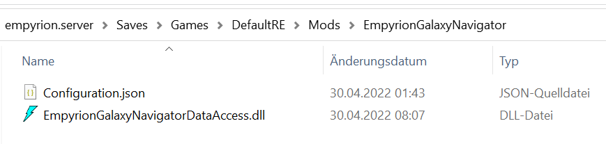

# Empyrion Galaxy Navigator
## Installation
1. Download der aktuellen ZIP datei von https://github.com/GitHub-TC/EmpyrionGalaxyNavigator/releases
1. Upload der Datei im EWA (EmpyrionWebAccess) MOD oder händische installation mit dem ModLoader aus https://github.com/GitHub-TC/EmpyrionGalaxyNavigator

## Wo für ist das?
Hiermit kann eine Navigation durch die Galaxie gestartet werden die einen durch die Galaxie zum Ziel leitet.


## Kommandos

* \\nav help =&gt; Liste der Kommandos
* \\nav stop =&gt; Eine laufende Navigation abbrechen
* \\nav &lt;target&gt; =&gt; Hiermit kann einen Navigation vom aktuellen Standort zum Ziel &lt;target&gt; gestartet werden. z.B. \nav Akua


### Bereitstellung für die externen Daten in der EmpyrionScriptingMod
Diese Dll muss eine Klasse welche das IMod Interface implementiert besitzen. Außerdem muss die ein Property 'ScriptExternalDataAccess' implementieren.
```
public class ExternalDataAccess : IMod
{
    public IDictionary<string, Func<IEntity, object[], object>> ScriptExternalDataAccess { get; }

    public ExternalDataAccess()
    {
        ScriptExternalDataAccess = new Dictionary<string, Func<IEntity, object[], object>>()
        {
            ["Navigation"] = (entity, args) => entity?.Structure?.Pilot?.Id > 0 ?         Navigation(entity) : null,
            ["MaxWarp"   ] = (entity, args) => entity?.Structure?.Pilot?.Id > 0 ? (object)MaxWarp   (entity) : null,
        };
    }
```

Des weiteren muss der Pfad zu der DLL in der Konfigurationsdatei des EmpyrionScripting angegeben werden. (Basis ist das Modverzeichnis des EmpyrionScripting im Savegame)
```
"AddOnAssemblies": [
    "..\\EmpyrionGalaxyNavigator\\EmpyrionGalaxyNavigatorDataAccess.dll"
],
```

Und die DLL muss an ihrem vorgesehen Platz kopiert werden (im Fall des EmyprionGalaxyNavigators in dessen Modverzeichins im Savegame)

Die DLL befindet sich in dieser Datei 'EmpyrionGalaxyNavigatorDataAccess.zip' welche im ModLoaderpaket enthalten ist oder unter https://github.com/GitHub-TC/EmpyrionGalaxyNavigator/releases heruntergeladen weden kann. 

Beim Aufruf der Funktionen werden die aktuelle Entität sowie die übergebenen 'args' mit übergeben.
(in diesem Fall werden keine weiteren Parameter für den Zugriff auf den GalaxyNavigator benötigt)
```
{{#external 'MaxWarp'}}
Maximale Sprungreichweite: {{.}}
{{/external}}
```

## Konfiguration
* LogLevel: Steuerung des Loggings
* ChatCommandPrefix: Zeichenfolge mit dem die Chatkommandos beginnen müssen
* MessageLoopMS: In welchem Intervall soll die Navigationsmeldung angezeigt werden
* NavigationTargets: Enthält die von Spielern gestarten laufenden Navigationen

***

English-Version:

---

# Empyrion Galaxy Navigator
## installation
1. Download the latest ZIP file from https://github.com/GitHub-TC/EmpyrionGalaxyNavigator/releases
1. Upload the file in the EWA (EmpyrionWebAccess) MOD or manual installation with the ModLoader from https://github.com/GitHub-TC/EmpyrionGalaxyNavigator

## What is it for?
This can be used to start a navigation through the galaxy, which guides you through the galaxy to the destination.


## Commands

* \\nav help =&gt; List of commands
* \\nav stop =&gt; Cancel a running navigation
* \\nav &lt;target&gt; =&gt; This can be used to start a navigation from the current location to the destination &lt;target&gt; e.g. \ nav Akua


### Providing for the external data in the EmpyrionScriptingMod.
This Dll must have a class which implements the IMod interface. Also, the must implement a property 'ScriptExternalDataAccess'.
```
public class ExternalDataAccess : IMod
{
    public IDictionary<string, Func<IEntity, object[], object>> ScriptExternalDataAccess { get; }

    public ExternalDataAccess()
    {
        ScriptExternalDataAccess = new Dictionary<string, Func<IEntity, object[], object>>()
        {
            ["Navigation"] = (entity, args) => entity?.Structure?.Pilot?.Id > 0 ?         Navigation(entity) : null,
            ["MaxWarp" ]   = (entity, args) => entity?.Structure?.Pilot?.Id > 0 ? (object)MaxWarp   (entity) : null,
        };
    }
```

Furthermore the path to the DLL must be specified in the configuration file of the EmpyrionScripting. (Basis is the mod directory of the EmpyrionScripting in the savegame).
```
"AddOnAssemblies": [
    "..\EmpyrionGalaxyNavigator\EmpyrionGalaxyNavigatorDataAccess.dll"
],
```

And the DLL must be copied to its intended place (in the case of EmyprionGalaxyNavigator in its mod directory in the savegame)

The DLL can be found in this file 'EmpyrionGalaxyNavigatorDataAccess.zip' which is included in the ModLoaderpaket or can be downloaded from https://github.com/GitHub-TC/EmpyrionGalaxyNavigator/releases. 

When the functions are called, the current entity and the passed 'args' are also passed.
(in this case no further parameters are needed to access the GalaxyNavigator).
```
{{#external 'MaxWarp'}}
Maximum jump range: {{.}}
{{/external}}
```

## Configuration
* LogLevel: Logging control
* ChatCommandPrefix: string with which the chat commands have to start
* MessageLoopMS: In which interval should the navigation message be displayed
* NavigationTargets: Contains the current navigations started by players